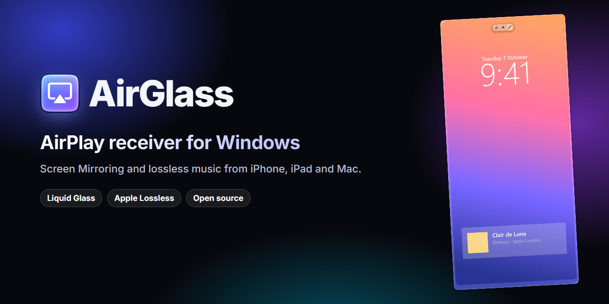
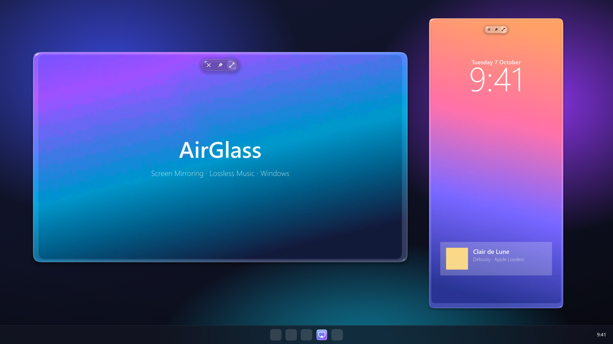

<div align="center">



# AirGlass

**The best-looking, best-sounding AirPlay receiver for Windows.**

Mirror your iPhone, iPad or Mac to a Windows PC in a Liquid Glass window,
and play AirPlay music in true lossless quality.

[](https://github.com/jdkuk/AirGlass/actions/workflows/ci.yml)
[](https://github.com/jdkuk/AirGlass/releases/latest)
[](https://github.com/jdkuk/AirGlass/releases)
[](LICENSE)


[**Download**](https://github.com/jdkuk/AirGlass/releases/latest) ·
[**Website**](https://jdkuk.github.io/AirGlass/) ·
[Get Pro ($2.99)](https://jdkuk.github.io/AirGlass/#pricing) ·
[Docs](docs/README.md) ·
[Report a bug](https://github.com/jdkuk/AirGlass/issues/new/choose)

</div>

<br>

<p align="center">
  
</p>

<p align="center"><sub>Real AirGlass frames, not mockups: the glass bezel, controls and shadow are rendered live on the GPU.</sub></p>

---

## ✨ Highlights

<table>
<tr>
<td width="50%" valign="top">

### 🪟 Liquid Glass window
A borderless, rounded window with a refractive glass rim that picks up the colours of your
screen. It springs in when a device starts mirroring, morphs smoothly when you rotate the phone,
and melts away when you stop.

</td>
<td width="50%" valign="top">

### 🎵 Bit-perfect lossless music
Music sent with AirPlay arrives as **Apple Lossless (ALAC 16-bit/44.1 kHz)** and is decoded
bit-for-bit. A 128-tap windowed-sinc resampler (>105 dB clean) does the one conversion your
sound card needs.

</td>
</tr>
<tr>
<td valign="top">

### ⚡ Smooth
Hardware H.264 decoding (D3D11VA, zero-copy), about **60 fps** mirroring, and every animation
running at your display's refresh rate, up to **120 Hz**. When nothing moves it uses 0% GPU.

</td>
<td valign="top">

### 🪶 Tiny, native, private
One C++20 app with its own mDNS (Bonjour) responder. No Bonjour install, no .NET, no browser
engine, no account, no analytics. Everything stays on your local network.

</td>
</tr>
</table>

## 🆓 Free and Pro

| | **Free** | **Pro** · $2.99 one-time |
|---|:---:|:---:|
| Screen Mirroring from iPhone, iPad and Mac | ✅ full screen | ✅ full screen **or** floating window |
| Lossless AirPlay music | ✅ | ✅ |
| Move, resize, smooth zoom | | ✅ |
| Keep on top, corner float | | ✅ |
| Use on up to 3 PCs | | ✅ |

Try it free to check it works with your devices. To unlock Pro, right-click the tray icon →
**Unlock windowed mode**, buy, and paste the license key from your receipt email. The key is
checked once online, and after that Pro also works offline. [How licensing works →](docs/licensing.md)

> [!NOTE]
> AirGlass is open source (GPL-3.0). Buying Pro pays for the signed, ready-to-run installer,
> updates and support, and keeps the project going. 💜

## 🚀 Get started

1. **Download** `AirGlass-Setup-x.y.z.exe` from the [latest release](https://github.com/jdkuk/AirGlass/releases/latest) and run it.
   It installs for your user account only. It asks for permission once, to add a firewall rule so your devices can find the PC.
2. **Mirror:** on your iPhone or iPad open **Control Center → Screen Mirroring** (two overlapping rectangles), and pick your
   PC's name. On a Mac, use **Control Center → Screen Mirroring**.
3. **Music:** in Music (or any audio app) tap the **AirPlay** button and pick your PC for lossless playback.

The receiver uses your PC's name. If another AirPlay device already has that name, AirGlass adds " PC".
To rename it, set `name=` under `[receiver]` in `%LOCALAPPDATA%\AirGlass\config.ini` and restart AirGlass.

<details>
<summary><b>⌨️ Window controls</b> (Pro)</summary>
<br>

| In the window | |
|---|---|
| Drag anywhere | move |
| Drag an edge / corner | resize (keeps the device's shape) |
| Mouse wheel | smooth zoom around the cursor |
| Double-click, <kbd>F</kbd> or <kbd>F11</kbd> | full screen (<kbd>Esc</kbd> leaves) |
| Hover | glass controls: ✕ disconnect · 📌 keep on top · ⤢ full screen |
| <kbd>P</kbd> | keep on top |
| Right-click | menu |

Rotating the device morphs the window between portrait and landscape. Audio plays through the default Windows output,
and the device's volume buttons control it. Tray icon (right-click): *Start with Windows*, *Open log folder*, *Quit*.

</details>

<details>
<summary><b>🎧 Sound quality details</b></summary>
<br>

* **Music** (AirPlay audio): Apple Lossless at about 0.9 Mbit/s for CD-quality 1.4 Mbit/s PCM, the most AirPlay sends to
  a receiver like this, decoded bit-exact. This is verified in tests against the original PCM.
* **One conversion only:** AirGlass plays in your output device's own format. For a conversion-free path, set the device to
  *44.1 kHz* in Windows Sound settings → device → Advanced.
* Music buffers about 0.25 s and re-requests lost Wi-Fi packets, so drop-outs are rare. Mirroring keeps a short buffer for lip sync.
* Screen Mirroring audio is always AAC-ELD, because the device chooses it. Use the AirPlay audio picker for music.

</details>

## ❓ FAQ

<details><summary><b>My PC doesn't show up on my iPhone.</b></summary><br>

The usual causes are a different network, a VPN, guest Wi-Fi, or the firewall rule being declined. See
[Troubleshooting](docs/troubleshooting.md).
</details>

<details><summary><b>Does it mirror in 4K?</b></summary><br>

AirGlass asks for up to 1080p. iPhones asked for 4K mirror landscape at only about 28 fps, while 1080p runs at about
60 fps. Full screen is upscaled with a bicubic filter. You can force a bigger display with `width`/`height` under `[video]`
in `config.ini`.
</details>

<details><summary><b>Can I AirPlay a YouTube or Netflix video?</b></summary><br>

Use Screen Mirroring. AirGlass doesn't support the "send a video link" kind of AirPlay. Protected video
(Netflix and similar) appears black when mirrored, by design of those apps.
</details>

<details><summary><b>Is it safe? Windows SmartScreen warned me.</b></summary><br>

New apps from small developers trigger SmartScreen until they build up reputation. Click *More info → Run anyway*.
The full source is here, and every release is built by [GitHub Actions](.github/workflows/release.yml) from a tagged commit.
</details>

<details><summary><b>Is AirGlass affiliated with Apple?</b></summary><br>

No. AirGlass is an independent project. It speaks the AirPlay protocol as documented by the open-source community
(UxPlay, RPiPlay and others).
</details>

## 🛠️ Build from source

```powershell
git clone https://github.com/jdkuk/AirGlass && cd AirGlass
powershell -ExecutionPolicy Bypass -File tools\fetch-deps.ps1   # llvm-mingw + FFmpeg (LGPL)
python build.py                                                 # -> build\AirGlass.exe
powershell -ExecutionPolicy Bypass -File deploy.ps1             # install for this user
```

Needs Windows 10/11, Python 3 and the Windows 10/11 SDK (for `fxc`). See [Building](docs/building.md) and
[Development & testing](docs/development.md). `python build.py --pro` builds a copy with Pro always unlocked.

## 📚 Documentation

| | |
|---|---|
| [Architecture](docs/architecture.md) | Threads, rendering pipeline, AirPlay protocol walkthrough |
| [Building](docs/building.md) | Toolchain, dependencies, build options |
| [Development & testing](docs/development.md) | Loopback sender, headless snapshots, debug switches |
| [Control pipe API](docs/control-pipe.md) | Drive AirGlass from another app (JSON over a named pipe) |
| [Licensing & editions](docs/licensing.md) | Free vs Pro, Lemon Squeezy keys, the GPL |
| [Troubleshooting](docs/troubleshooting.md) | Discovery, firewall, VPNs, audio |
| [Privacy](docs/privacy.md) | What leaves your PC (almost nothing) |
| [Releasing](docs/releasing.md) | Versioning, tags, the release workflow |

## 🤝 Contributing

Bug reports, device test results and pull requests are welcome. Please read [CONTRIBUTING.md](CONTRIBUTING.md) and
our [Code of Conduct](CODE_OF_CONDUCT.md). Security issues: see [SECURITY.md](SECURITY.md).

## 📄 License & credits

AirGlass is free software under the [GNU General Public License v3.0](LICENSE).

* FairPlay handshake (`playfair`) and protocol details from [UxPlay](https://github.com/FDH2/UxPlay) /
  RPiPlay (GPL-3.0)
* Ed25519 from [orlp/ed25519](https://github.com/orlp/ed25519) (zlib)
* Decoding by [FFmpeg](https://ffmpeg.org) (LGPL), linked dynamically

Details in [THIRD_PARTY_NOTICES.md](THIRD_PARTY_NOTICES.md).

<sub>AirPlay, iPhone, iPad and Mac are trademarks of Apple Inc., registered in the U.S. and other countries.
AirGlass is not affiliated with or endorsed by Apple Inc.</sub>
